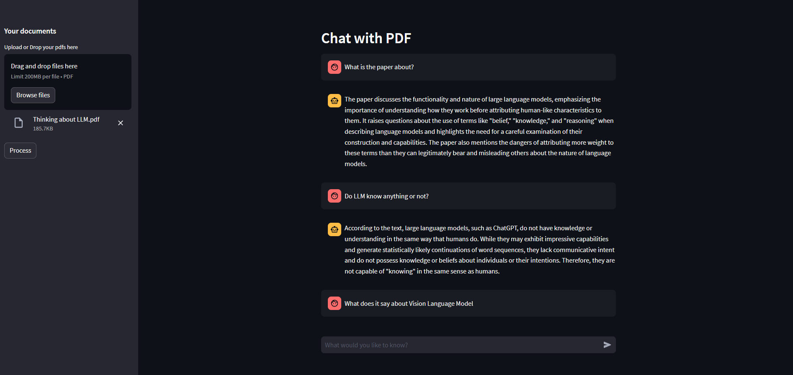

# Chat With PDF
This project utilizes Langchain to allow user to query about the contents of pdfs uploaded through the use of Large Language Model. It allows user to upload multiple pdfs and allow them to ask questions related to it, which would be answer by the llm.
## Features
* Upload multiple pdfs
* Ask question in regard to the content of the documents and get answers generated by the llm model.

## Setting up the project
* Clone the repository using `git clone https://github.com/niranjanblank/ChatwithPDF`
* Change the working directory `cd ChatwithPDF`
* Setup a virtual env using `python -m venv venv`
* Activate the virtual env
* Install the required libraries using `pip install -r requirements.txt`
* Setup a .env file in the root folder and include `OPENAI_API_KEY` in it as: 
    `OPENAI_API_KEY = Your OPEN AI API KEY`
* Run the app.py file using `streamlit run app.py`
* Now you can upload the pdfs and ask queries regarding it.

## Screenshots
